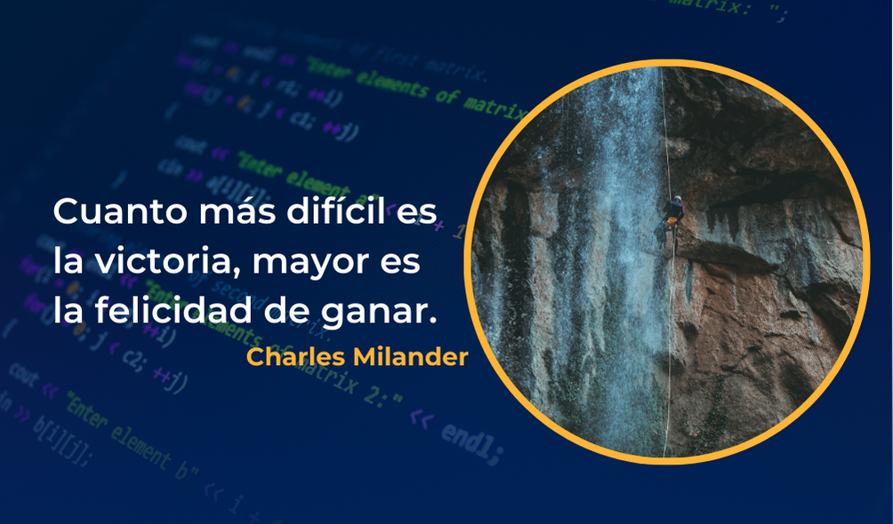

Hello  <h2>Mi nombre es Christian Loo</h2>
=====================================================================================================================================

Web Developer
-------------

*   🌍  Panamá
*   🖥️  Checa mi portafolio -> [Portafolio](http://christianloo.vercel.app/)
*   ✉️  Si deseas contactarme -> [christianloo0812@gmail.com](mailto:christianloo0812@gmail.com)

Skills 
-------------

Frases para Motivarse
-------------

Avanzando por el camino de la programación, se aprende algo nuevo todos los días.

Socials
-------------

 <a href="https://www.github.com/CLoo08" target="_blank" rel="noreferrer"> <picture> <source media="(prefers-color-scheme: dark)" srcset="https://raw.githubusercontent.com/danielcranney/readme-generator/main/public/icons/socials/github-dark.svg" /> <source media="(prefers-color-scheme: light)" srcset="https://raw.githubusercontent.com/danielcranney/readme-generator/main/public/icons/socials/github.svg" />  </picture> </a> <a href="https://www.linkedin.com/in/christian-loo-4b3569300" target="_blank" rel="noreferrer"> <picture> <source media="(prefers-color-scheme: dark)" srcset="https://raw.githubusercontent.com/danielcranney/readme-generator/main/public/icons/socials/linkedin-dark.svg" /> <source media="(prefers-color-scheme: light)" srcset="https://raw.githubusercontent.com/danielcranney/readme-generator/main/public/icons/socials/linkedin.svg" />  </picture> </a>

 Badges
-------------

